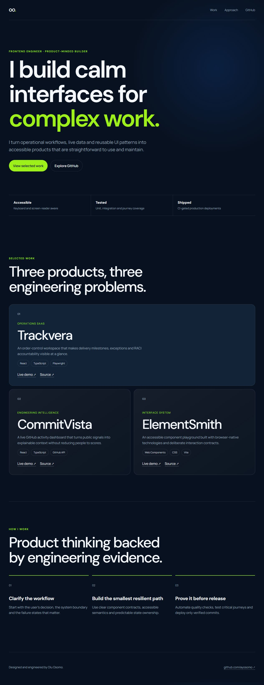

# UCD Resume — Portfolio

[](https://github.com/ayosomo/UCD-resume/actions/workflows/ci.yml)

A focused frontend-engineering portfolio for Olu Osomo. The site presents selected products, the engineering problems behind them, Olu's professional journey and the quality practices used to ship dependable interfaces.

| | |
| --- | --- |
| **Live demo** | [Open the portfolio](https://olu-osomo-portfolio.vercel.app/) |
| **Stack** | Semantic HTML, modern CSS, JavaScript, Vite |
| **Tests** | Node test runner for structure, content and privacy checks |
| **Deployment** | Vercel |

## Screenshot



## Highlights

- Clear positioning and product-focused project case studies
- Direct links to live demos and source repositories
- Responsive layout with a distinctive high-contrast visual system
- Resume-informed experience, education and skills sections
- Accessible mobile navigation, semantic landmarks and visible keyboard focus
- Progressive reveal effects with reduced-motion support
- No home address, phone number or non-functional contact form

## Installation

Prerequisites: Node.js 22.13 or newer and pnpm.

```bash
git clone https://github.com/ayosomo/UCD-resume.git
cd UCD-resume
pnpm install
pnpm test
pnpm build
```

Start the local development server:

```bash
pnpm dev
```

## Tests

```bash
pnpm test
```

The test suite verifies the document structure, project links, accessibility hooks, stylesheet reference and the removal of obsolete personal contact details.

## Project structure

```text
.
├── .github/workflows/  # CI and GitHub Pages release
├── assets/css/         # Visual system and responsive layout
├── assets/js/          # Navigation and progressive enhancement
├── docs/images/        # README screenshot
├── tests/              # Dependency-free source checks
└── index.html          # Portfolio content and semantic structure
```

## Licence

Copyright (c) 2026 Olu Osomo. All rights reserved. The source is available for portfolio review.
